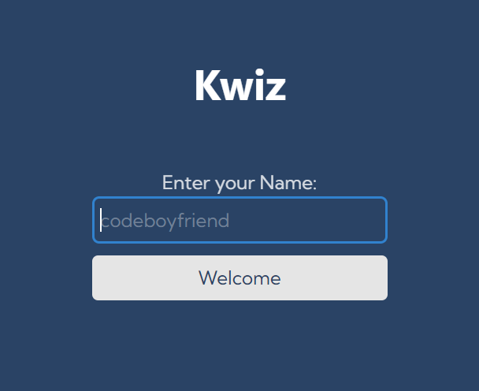
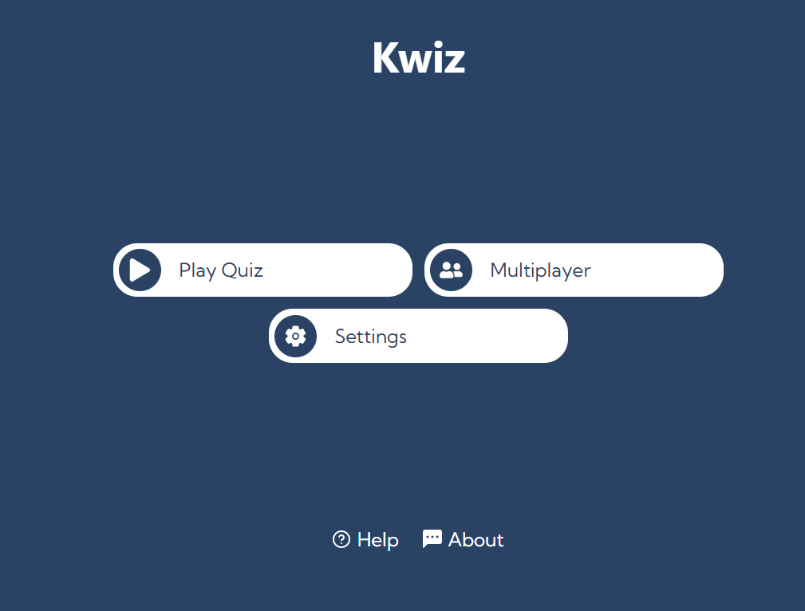
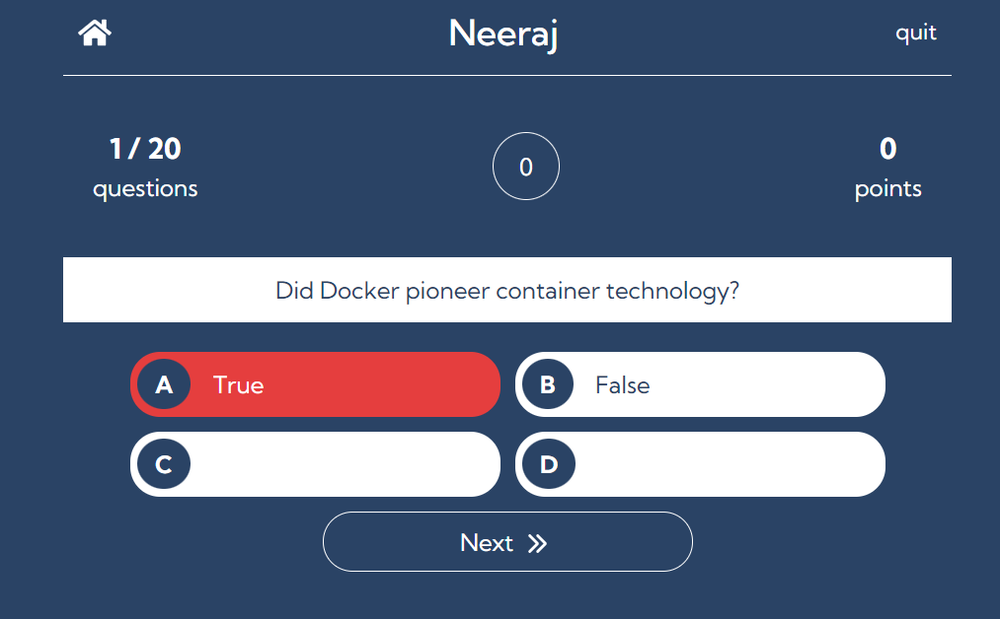
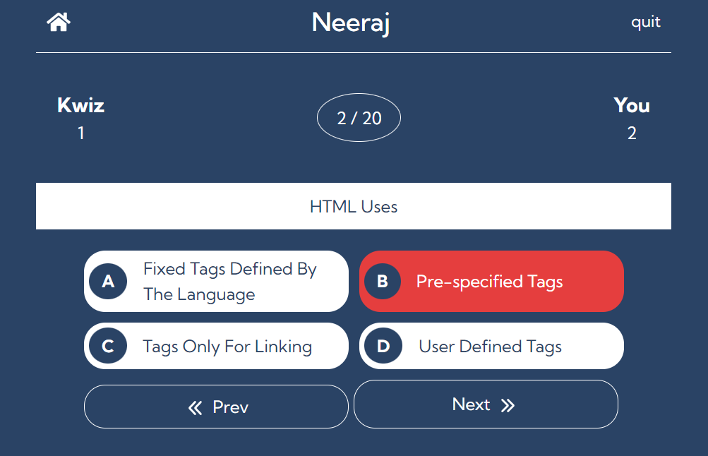
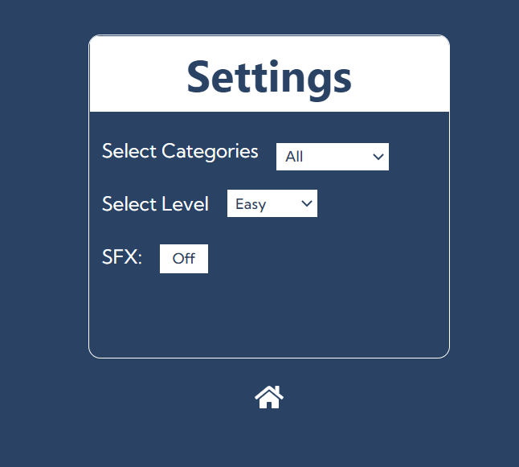
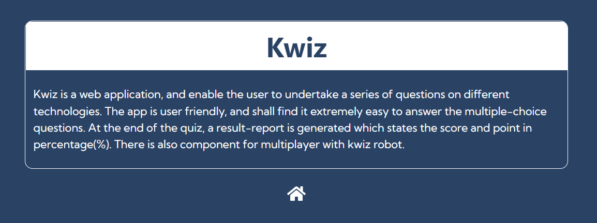
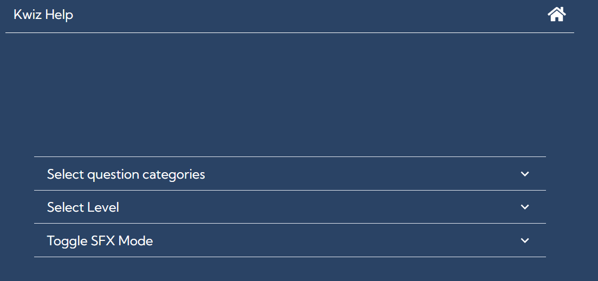

# Kwiz

Kwiz is a web application that enable the user to undertake a series of questions on different technologies. The app is user friendly, and the user will find it extremely easy to answer the multiple-choice questions. At the end of the quiz, a result report is generated which shows the score and points in percentage(%). There is also component for multiplayer with kwiz robot. 

> Technologies used
- React
- Javascript
- Chakra UI
- quizapi

> To check out Kwiz
- Visit [Kwiz](https://kwiiz.netlify.app/)
- [Source code](https://github.com/codeboyfriend/Quiz)

> Contributions 👨‍💻
- Contributions make the open source community such an amazing place to learn, inspire, and create.
- Any contribution you make will be greatly appreciated.
- Check out our [contribution guidelines](./CONTRIBUTING.md) for more information.

> Screenshots
 
 
 
 
 
 
 

⭐️ Show some ❤️ by starring the repository.
